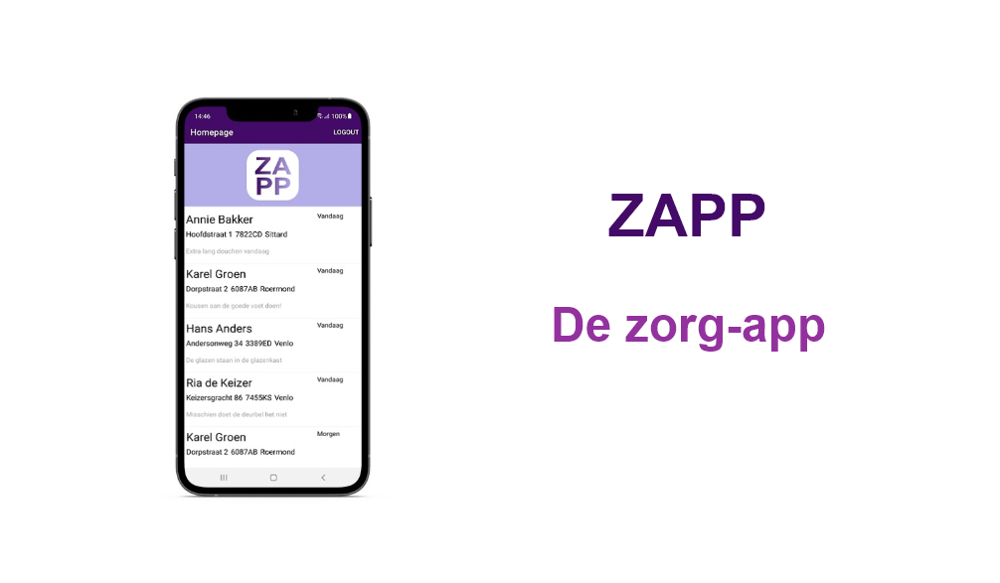

# Zapp

# ZAPP

ZAPP is een mobiele app waarmee zorgverleners hun taken bij cliënten effectiever kunnen uitvoeren.

## Technologieën

De applicatie is gebouwd in C#, in Xamarin Forms. De data komt via API van Cockpit CMS.  
De volgende technologieën heb ik gebruikt:

- C#
- .Net / Xamarin Forms
- Cockpit CMS
- API

## Andere projecten:

Verrukkulluk! https://github.com/RoyDerix/Verrukkulluk  
VacIT! https://github.com/RoyDerix/Vacit
